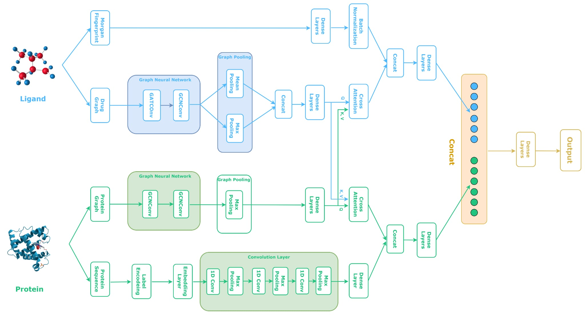

# Drug-Target Affine Prediction using Graph Neural Networks

## Overview
This project implements a deep learning approach for predicting drug-target binding affinities (DTA) using Graph Neural Networks (GNNs). The model combines different GNN architectures including Graph Convolutional Networks (GCN), Graph Attention Networks (GAT), and Graph Isomorphism Networks (GIN) to learn the complex relationships between drugs and proteins and predict their binding affinities.

## Features
- Multiple GNN architectures (GCN, GAT, GIN)
- Support for both drug and protein graph data
- Integration of 3D protein structure information
- SMILES to graph conversion for drug molecules
- Binding affinity prediction for drug-target pairs

## Model Architectures
+The following figure illustrates the overall architecture of the proposed system:

- **gat_gcn.py**: This is the main model architecture depicted in the figure above, combining GAT and GCN layers for the drug graph branch.
- **gin.py**: A variant that implements the GIN (Graph Isomorphism Network) architecture for the drug graph branch.
- **gat.py**: A variant that implements the GAT (Graph Attention Network) architecture for the drug graph branch.
- **graphOnly.py**: Keeps only the graph branches of drug and protein, performing direct cross-attention between these two branches.
- **noMorgan.py**: Removes the Morgan fingerprint branch, using cross-attention between the drug graph, protein graph, and 1D protein branch.
- **no1D.py**: Removes the 1D protein branch, performing cross-attention between the protein graph, drug graph, and Morgan fingerprint branch.


## Requirements
- Python 3.x
- PyTorch
- PyTorch Geometric
- RDKit
- NetworkX
- NumPy
- Pandas


## Data
The project uses two benchmark datasets:
- DAVIS: Contains kinase inhibitors and their binding affinities
- KIBA: Contains kinase inhibitors and their binding affinities


---

## How to Run This Project

### Step 1: Clone the repository
```bash
git clone https://github.com/dinhngoctoan/DATN_DTA
cd DATN_DTA
```

### Step 2: Install required libraries
You can use the following commands (for Google Colab or local with pip):
```bash
!pip install rdkit-pypi
!pip install torch-scatter -f https://data.pyg.org/whl/torch-2.1.0+cu118.html
!pip install torch-sparse -f https://data.pyg.org/whl/torch-2.1.0+cu118.html
!pip install torch-cluster -f https://data.pyg.org/whl/torch-2.1.0+cu118.html
!pip install torch-spline-conv -f https://data.pyg.org/whl/torch-2.1.0+cu118.html
!pip install torch-geometric
```

### Step 3: Prepare the data
```bash
python create_data.py
```
This will process and prepare the datasets for training.

### Step 4: Train the model
```bash
python training.py x y z
```
Where:
- `x`: Dataset selection
  - `0` for DAVIS
  - `1` for KIBA
- `y`: Model selection
  - `0` for GIN (gin.py)
  - `1` for GAT (gat.py)
  - `2` for GAT+GCN (gat_gcn.py, the main architecture in the figure)
  - `3` for no1D (no1D.py)
  - `4` for noMorgan (noMorgan.py)
  - `5` for graphOnly (graphOnly.py)
- `z` (optional): CUDA device index (default is 0, i.e., "cuda:0")

**Example:**  
To train the main model (GAT+GCN) on the DAVIS dataset using the first CUDA device:
```bash
python training.py 0 2 0
```


